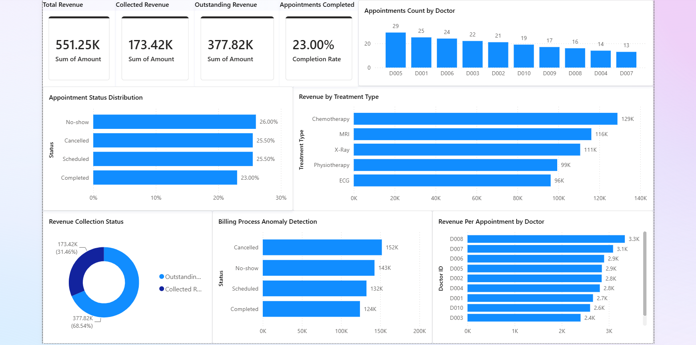
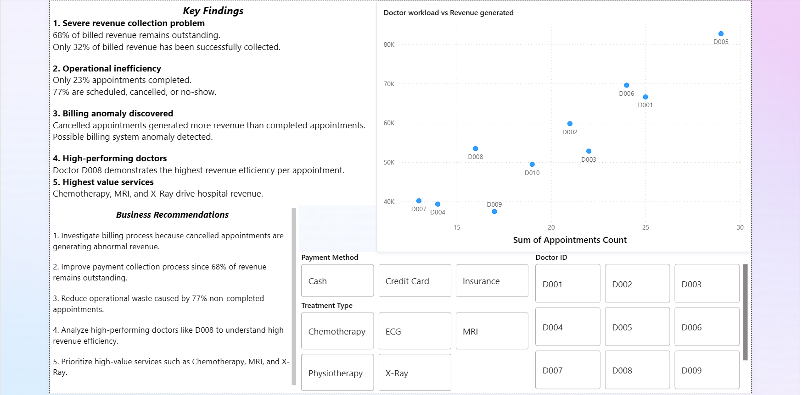

# Hospital Revenue, Operations & Billing Analysis

End-to-end healthcare analytics project focused on hospital financial performance, operational efficiency, billing behavior, and doctor performance.

This project simulates a real-world data analyst workflow by working with raw hospital datasets, performing SQL analysis, Python exploratory data analysis, anomaly investigation, and building an interactive Power BI dashboard.

---

## Project Objective

The goal of this project was to answer business-critical hospital management questions such as:

- How much revenue is actually being collected?
- Which treatment types generate the most revenue?
- Which doctors generate the highest value?
- How much operational waste exists due to cancellations and no-shows?
- Are there anomalies in the hospital billing process?

---

## Tools Used

- **SQL (MySQL)** → Database creation, joins, business queries  
- **Python** → Data cleaning and exploratory analysis  
- **Pandas** → Data manipulation and merging  
- **Matplotlib / Seaborn** → Visualizations and anomaly investigation  
- **Power BI** → Interactive dashboard creation  

---

## Dataset

Dataset contains 5 CSV files representing hospital operations:

- Patients
- Doctors
- Appointments
- Treatments
- Billing

Source:

Dataset obtained from Kaggle public healthcare dataset.

---

## Project Workflow

### 1. SQL Database Design

Created relational database and imported all CSV files.

Created 5 tables:

- patients
- doctors
- appointments
- treatments
- billing

Performed SQL analysis using joins, aggregations, and business queries.

Example business questions:

- Which doctors handle the most appointments?
- Which treatment types generate the most revenue?
- Which patients have unpaid bills?
- Which specializations generate the highest revenue?
- Which patients spent the most money?

---

### 2. Python Data Cleaning & Analysis

Performed data cleaning and datatype standardization.

Tasks:

- Converted date columns to datetime
- Standardized phone numbers as text
- Created patient age column
- Merged multiple tables for analysis
- Created exploratory visualizations

Libraries used:

```python
import pandas as pd
import matplotlib.pyplot as plt
import seaborn as sns
```

---

### 3. Anomaly Investigation

During analysis, a major anomaly was discovered.

Patient **P012** had the highest total spending in the entire dataset.

However:

- Most appointments were Cancelled or No-show
- Billing records still existed for those appointments
- Charges were still applied despite appointments not being completed

Further investigation revealed:

### Revenue generated by appointment status

| Status | Revenue |
|----------|----------|
| Cancelled | $152,044 |
| No-show | $142,677 |
| Scheduled | $132,426 |
| Completed | $124,100 |

Unexpected finding:

**Cancelled appointments generated more revenue than completed appointments.**

Possible explanation:

- Billing system invoices patients before service delivery
- Charges are not reversed after cancellations/no-shows
- Potential billing process flaw

Business risk:

- Inflated revenue reporting
- Customer billing disputes
- Poor patient experience

---

## Key Insights

### Revenue Collection Problem

- Total Revenue = $551,249
- Paid Revenue = $173,424
- Outstanding Revenue = $377,824

Only **32% of billed revenue was successfully collected**

---

### Operational Inefficiency

Appointment distribution:

- Completed = 23%
- No-show = 26%
- Cancelled = 25.5%
- Scheduled = 25.5%

Only **23% of appointments were successfully completed**

---

### Highest Revenue Treatments

Top services:

- Chemotherapy
- MRI
- X-Ray

These services drive hospital revenue.

---

### Doctor Performance

Highest revenue per appointment:

| Doctor | Revenue per Appointment |
|----------|----------|
| D008 | 3339 |
| D007 | 3089 |
| D006 | 2899 |

Doctor D008 generated the highest revenue efficiency.

---

## Power BI Dashboard

## Dashboard Preview

### Executive Dashboard

Main dashboard showing:

- Revenue KPIs
- Appointment completion rate
- Treatment revenue analysis
- Revenue anomaly detection
- Doctor performance metrics



---

### Insights & Interactive Filters

Secondary dashboard page for:

- Key business findings
- Interactive slicers for treatment type, payment method, and doctor analysis
- Doctor workload vs revenue relationship



---

## Files Included

Project files:

- hospital_analysis.sql → SQL queries and database analysis
- hospital_analysis.ipynb → Python data cleaning and exploratory analysis
- hospital_dashboard.pbix → Interactive Power BI dashboard
- dashboard.png → Power BI executive dashboard screenshot
- insights.png → Power BI insights and slicers page screenshot

Dataset files:

- patients.csv
- doctors.csv
- appointments.csv
- treatments.csv
- billing.csv

---

## Final Business Recommendations

Based on analysis:

### Improve billing process

Investigate why cancelled and no-show appointments are still generating revenue.

### Improve revenue collection

68% of billed revenue remains outstanding.

### Reduce operational waste

77% of appointments are not completed successfully.

### Focus on high-value services

Chemotherapy, MRI, and X-Ray drive most revenue.

### Study doctor efficiency

Investigate practices used by high-performing doctors.

---

## Project Type

End-to-End Data Analyst Portfolio Project

Excel + SQL + Python + Power BI + Business Intelligence + Data Visualization

## Repository Structure

```text
hospital-revenue-operations-analysis/
│
├── Data/
│   ├── patients.csv
│   ├── doctors.csv
│   ├── appointments.csv
│   ├── treatments.csv
│   └── billing.csv
│
├── SQL/
│   └── hospital_analysis.sql
│
├── Python/
│   └── hospital_analysis.ipynb
│
├── PowerBI/
│   └── hospital_dashboard.pbix
│
├── dashboard.png
├── insights.png
│
└── README.md
```
